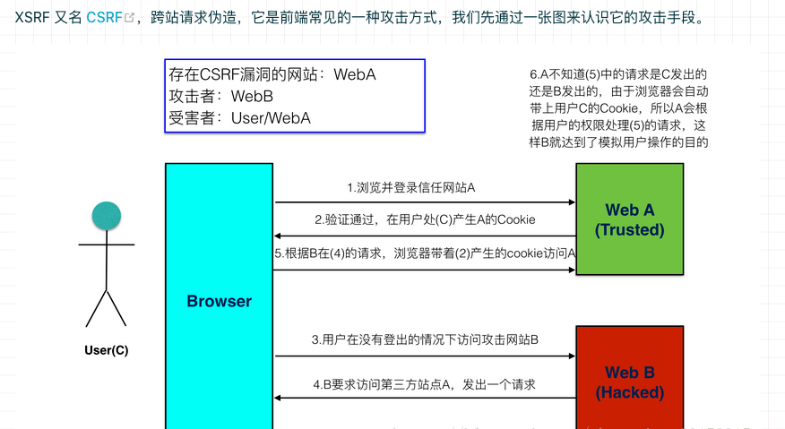

# ts-axios

TypeScript 仿写 axios

## 需求分析

- 在浏览器端使用 XMLHttpRequest 对象通讯
- 支持 Promise API
- 支持请求和响应的拦截器
- 支持请求数据和响应数据的转换
- 支持请求的取消
- JSON 数据的自动转换
- 客户端防止 XSRF

## 项目初始化

- 使用了 [typescript-library-starte](https://github.com/alexjoverm/typescript-library-starter)
  - 使用 RollupJS 帮助我们打包。
  - 使用 Prettier 和 TSLint 帮助我们格式化代码以及保证代码风格一致性。
  - 使用 TypeDoc 帮助我们自动生成文档并部署到 GitHub pages。
  - 使用 Jest 帮助我们做单元测试。
  - 使用 Commitizen 帮助我们生成规范化的提交注释。
  - 使用 Semantic release 帮助我们管理版本和发布。
  - 使用 husky 帮助我们更简单地使用 git hooks。
  - 使用 Conventional changelog 帮助我们通过代码提交信息自动生成 change log。

## jest

```javascript
"jest": {
  // 转换器配置，表示使用 ts-jest 工具把 .ts/.tsx 文件内容转换成 js (nodejs不支持 ts，所以需要转换)
  "transform": {
    ".(ts|tsx)": "ts-jest"
  },
  // 测试环境，jsdom 是一个类浏览器的测试环境，可以使用浏览器环境中的一些 API
  "testEnvironment": "jsdom",
  // 要测试文件的匹配正则
  "testRegex": "(/__tests__/.*|\\.(test|spec))\\.(ts|tsx|js)$",
  // 模块文件扩展名，当去引入一个模块并没有指定扩展名时，会尝试去添加这些扩展名找引入的模块文件
  // 优先 ts > tsx > js
  "moduleFileExtensions": [
    "ts",
    "tsx",
    "js"
  ],
  // 测试覆盖率会忽略的文件
  "coveragePathIgnorePatterns": [
    "/node_modules/",
    "/test/"
  ],
  // 测试覆盖率的阈值设定，当测试覆盖率达不到阈值时，测试会失败
  "coverageThreshold": {
    "global": {
      "branches": 90, // 分支的覆盖率达到 90%
      "functions": 95, // 函数的覆盖率达到 95%
      "lines": 95, // 代码行数的覆盖率达到 95%
      "statements": 95 // 声明的覆盖率达到 95%
    }
  },
  // 收集指定文件的测试覆盖率(即使没为这些文件编写测试)
  // 以下配置表示收集 src 目录以及它的所有子目录中的 js 和 ts 文件的测试覆盖率
  "collectCoverageFrom": [
    "src/*.{js,ts}",
    "src/**/*.{js,ts}"
  ],
  // 测试框架安装后立即执行的代码文件列表
  // 表示每次跑具体的测试代码之前会先运行 boot.ts 中的代码
  "setupFilesAfterEnv": [
    "<rootDir>/test/boot.ts"
  ]
},
```

## csrf



CSRF 的防御手段有很多，比如验证请求的 referer，但是 referer 也是可以伪造的，所以杜绝此类攻击的一种方式是服务器端要求每次请求都包含一个 token，这个 token 不在前端生成，而是在我们每次访问站点的时候生成，并通过 set-cookie 的方式种到客户端，然后客户端发送请求的时候，从 cookie 中对应的字段读取出 token，然后添加到请求 headers 中。这样服务端就可以从请求 headers 中读取这个 token 并验证，由于这个 token 是很难伪造的，所以就能区分这个请求是否是用户正常发起的。

对于我们的 ts-axios 库，我们要自动把这几件事做了，每次发送请求的时候，从 cookie 中读取对应的 token 值，然后添加到请求 headers 中。我们允许用户配置 xsrfCookieName 和 xsrfHeaderName，其中 xsrfCookieName 表示存储 token 的 cookie 名称，xsrfHeaderName 表示请求 headers 中 token 对应的 header 名称。

```javascript
axios
  .get('/more/get', {
    xsrfCookieName: 'XSRF-TOKEN', // default
    xsrfHeaderName: 'X-XSRF-TOKEN' // default
  })
  .then(res => {
    console.log(res)
  })
```

我们提供 xsrfCookieName 和 xsrfHeaderName 的默认值，当然用户也可以根据自己的需求在请求中去配置 xsrfCookieName 和 xsrfHeaderName
